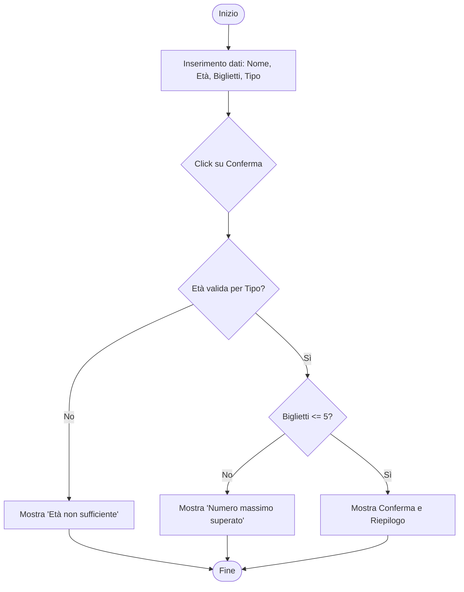

# Documento Architetturale dell'Applicativo - Booking System

## 1. Rappresentazione del Flusso Logico

L'applicativo gestisce il processo di registrazione seguendo un flusso sequenziale di validazione dei dati inseriti dall'utente.

## 2. Input dell'Applicativo

L'interfaccia raccoglie i seguenti dati tramite un modulo HTML:
- **Nome Partecipante** (`string`): Identificativo dell'utente.
- **Età** (`number`): Utilizzata per i controlli di accesso.
- **Numero di Biglietti** (`number`): Quantità richiesta.
- **Tipo di Ingresso** (`string`): Selezione tra "Standard" o "VIP".

## 3. Controlli Logici e Condizioni

L'applicativo esegue le seguenti verifiche in ordine di priorità:

1.  **Validazione Età**:
    - Se `Tipo == VIP` AND `Età < 18` -> Errore.
    - Se `Tipo == Standard` AND `Età < 16` -> Errore.
2.  **Validazione Quantità**:
    - Se `Biglietti > 5` -> Errore.

## 4. Principali Elaborazioni

- **Event Handling**: Ascolto dell'evento `submit` del form per prevenire il ricaricamento della pagina e avviare la logica TS.
- **Data Parsing**: Conversione delle stringhe provenienti dagli input in numeri interi per i calcoli logici.
- **DOM Manipulation**: Aggiornamento dinamico delle classi CSS (per mostrare/nascondere messaggi) e del contenuto testuale del risultato.

## 5. Output o Risultati Restituiti

- **In caso di errore**: Un messaggio rosso evidenziato che specifica il motivo del fallimento (età insufficiente o troppi biglietti).
- **In caso di successo**: Un messaggio verde con il riepilogo della prenotazione (Nome, Numero Biglietti, Tipo).
- **Stato finale**: Reset del modulo in caso di successo per consentire una nuova operazione.
