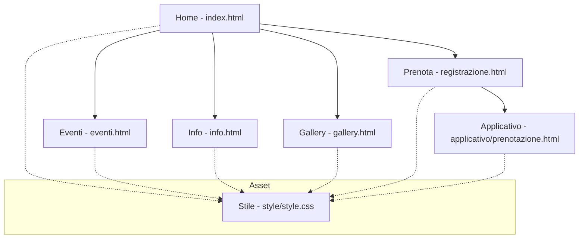

# Documento Architetturale del Sito Web - Neon Pulse Festival

## 1. Sitemap (Schema Grafico)

## 2. Descrizione delle Pagine

Il sito è strutturato in modo gerarchico per facilitare la navigazione:

- **Home ([index.html](index.html))**: Presentazione del festival e call-to-action principale.
- **Eventi ([eventi.html](eventi.html))**: Programma dettagliato e date delle performance.
- **Info ([info.html](info.html))**: Informazioni logistiche, sicurezza e contatti.
- **Gallery ([gallery.html](gallery.html))**: Archivio fotografico delle edizioni passate.
- **Prenota ([registrazione.html](registrazione.html))**: Pagina di atterraggio per l'utente prima dell'accesso all'acquisto.
- **Applicativo ([prenotazione.html](applicativo/prenotazione.html))**: Form interattivo per l'acquisto dei biglietti.

## 3. Design e Stile

- **[style.css](style/style.css)**: File unificato che gestisce l'intero layout del sito e dell'applicativo.
- **Identità Visiva**: Colori neon (Pink, Cyan) su sfondo nero per richiamare l'estetica della musica elettronica.
- **Responsive Design**: Utilizzo di Flexbox e Grid per garantire la compatibilità con dispositivi mobile e desktop.

## 4. Navigazione e UX

- **Sticky Navigation**: Un menu superiore fisso garantisce l'accesso rapido a tutte le sezioni da qualsiasi punto del sito.
- **User Flow**: L'utente viene guidato dalle informazioni (Home/Eventi) verso l'azione finale (Prenotazione).
