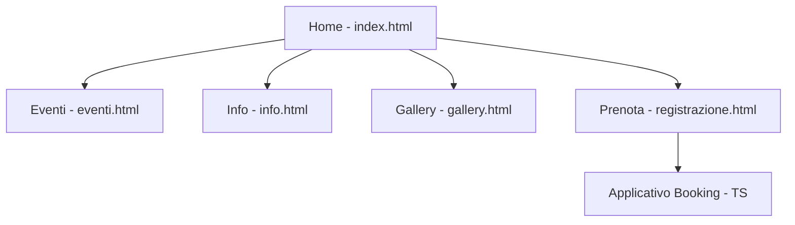

# Documento Architetturale del Sito Web - Neon Pulse Festival

## 1. Alberatura delle Pagine (Site Map)

Il sito è strutturato in modo gerarchico per facilitare la navigazione dell'utente attraverso le diverse sezioni informative e operative.

- **Home (index.html)**: Punto di ingresso principale, presentazione del festival e call-to-action per la prenotazione.
- **Eventi (eventi.html)**: Dettaglio del programma giornaliero del festival.
- **Info (info.html)**: Informazioni logistiche, location e regole di sicurezza.
- **Gallery (gallery.html)**: Contenuti visivi delle edizioni passate per coinvolgere l'utente.
- **Prenota (registrazione.html)**: Pagina di transizione che contiene il link diretto all'applicativo di prenotazione TypeScript.

## 2. Descrizione delle Principali Sezioni

### Header
Presente in tutte le pagine, contiene il logo del festival e il menu di navigazione principale. È fissato in alto (sticky) per garantire l'accesso rapido alle altre sezioni in ogni momento.

### Hero Section (Home)
Un'area d'impatto con un'immagine di sfondo suggestiva, un titolo forte e un pulsante rapido per l'acquisto dei biglietti.

### Griglia dei Contenuti
Utilizzata nelle pagine Eventi e Gallery per organizzare le informazioni in modo pulito e responsive, adattandosi a diversi dispositivi.

### Sezione di Prenotazione
Situata nella pagina `registrazione.html`, funge da ponte tra il sito informativo e l'applicativo funzionale, spiegando chiaramente i passaggi necessari all'utente.

## 3. Navigazione tra le Pagine

La navigazione è di tipo **orizzontale** attraverso il menu principale. 
- Ogni pagina è collegata a tutte le altre tramite la barra di navigazione.
- Sono presenti link interni (bottoni) che guidano l'utente verso il flusso di conversione (Prenotazione).
- Il design è coerente in termini di colori (Neon Pink, Black, Cyan) e font per mantenere l'identità visiva del brand.
