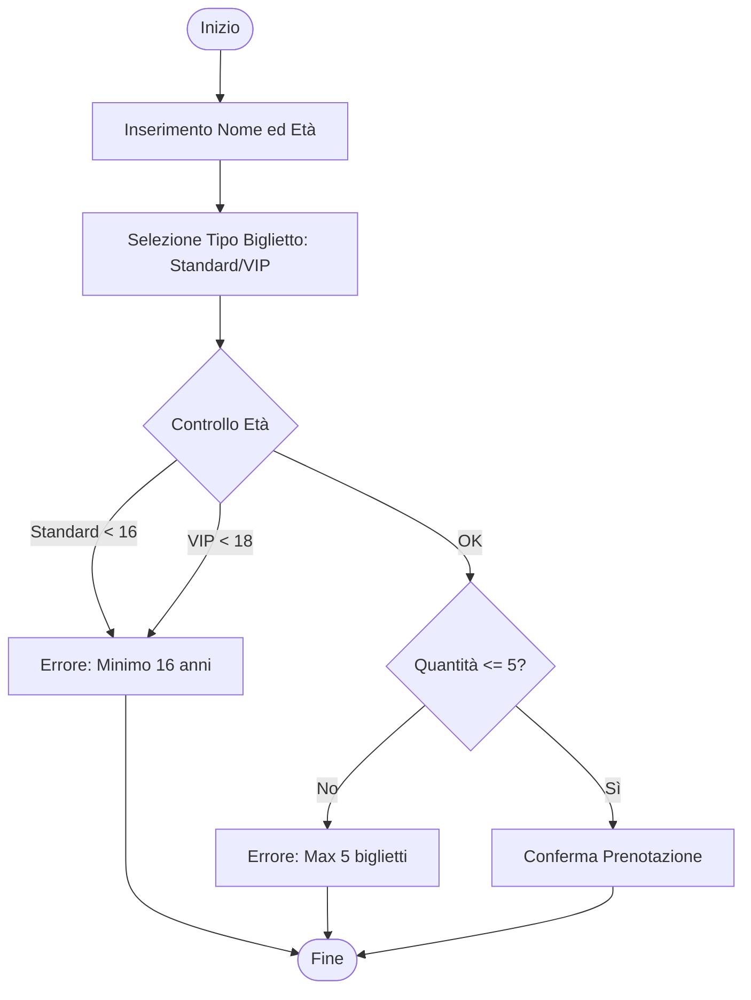

# Documento Architetturale dell'Applicativo Booking

## 1. Descrizione Funzionale

L'applicativo gestisce la prenotazione dei biglietti per il festival Neon Pulse tramite un'interfaccia interattiva e dinamica.

## 2. Diagramma di Flusso (Logic Schema)

## 3. Tecnologie Utilizzate

- **TypeScript ([script.ts](script.ts))**: Sviluppo della logica con tipizzazione forte per ridurre errori a runtime.
- **JavaScript ([script.js](script.js))**: Output compilato per l'esecuzione cross-browser.
- **HTML5/CSS3 ([prenotazione.html](prenotazione.html))**: Struttura semantica e integrazione con il sistema di stile globale.

## 4. Logica di Business e Vincoli

- **Validazione Nome**: Il sistema impedisce l'inserimento di numeri nel campo nome per garantire l'integrità dei dati.
- **Validazione Età**: 
  - **Standard**: Richiede un'età minima di 16 anni.
  - **VIP**: Richiede un'età minima di 18 anni (accesso aree riservate).
- **Limite Quantitativo**: Impedisce l'acquisto di più di 5 biglietti per singola transazione.
- **Feedback Dinamico**: Utilizzo di classi CSS e manipolazione del DOM per mostrare messaggi di stato. I messaggi di conferma sono personalizzati in base al tipo di biglietto (Standard/VIP) e al numero di biglietti (singolare/plurale).

## 5. Struttura Tecnica del Codice

- **Interfacce**: Definizione di `BookingData` per garantire l'integrità dell'oggetto di prenotazione.
- **Moduli**: Separazione delle responsabilità tra logica di calcolo (`processBooking`) e gestione dell'interfaccia (`showResult`).
